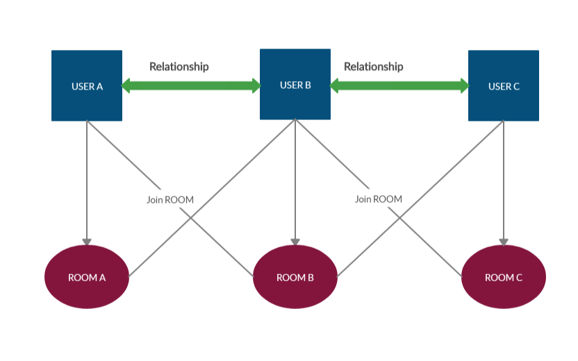

# Socket.io-feed

news feed Application with real time Contents updates .It is based on Relationships,which means Application emits the contents to Sender and Sender's Connections, also stored the contents to Database
.

### Includes

- [ExpressJS](https://expressjs.com)
- [NodeJS](https://nodejs.org/en/)
- [Socket.io](https://socket.io/docs)
- [Mysql](https://www.mysql.com/)
- [Ejs](https://ejs.co/)

 play around socket.io with this Application or use it to implement relationship based feed.

Relationship:
```
Admin-->Users
User<-->User
User-->Users
```

**Features**
* Connect New user to all the online friends 
* Connect online users to new Users
* User get all the recent posts of friends through database
* Real time feed updates on new contents


## Socket.io Logic

[sockets.io Rooms](https://socket.io/docs/rooms-and-namespaces/)



A room gets created for each user on log in , which means if **Example** User A log in to The application A Unique room get created of User A

the application then joins all the Online available Friends to User A Room to get the updates as User A post.


**Application Flow**

```
* User A login to Application
* Room A get created
* Relation of User A log in to application
* Relation room get created 
* User A and Relation both get each other recent posts in their feed, also
* User A join Relation room , Relation join User A room (To see each other posts updates in realtime)
```


Installation
------------
```
 Install [node](http://nodejs.org/#download)
 git clone https://github.com/Aakashk14/Socket.io-feed.git 
 cd socket-io-feed.git
 npm install
  
 Import Demo Database 
 node app.js
```
